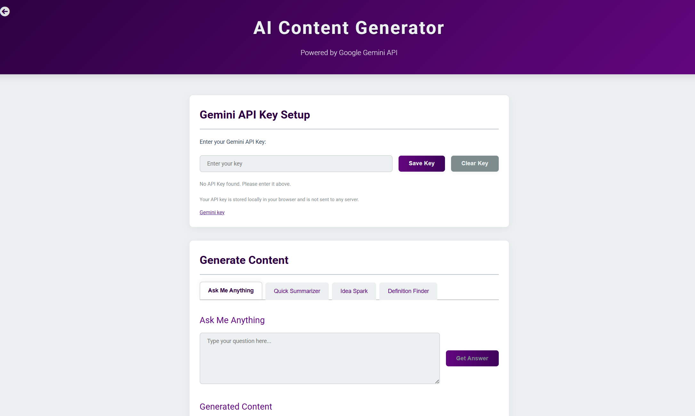

A collection of small web projects built using the **MERN Stack** and enhanced with **AI capabilities**.  
Each project is designed to demonstrate practical, interactive web development concepts — from quizzes to AI-based content creation.

## 🌐 Live Demo  
🔗 **Visit here:** [Project](https://ngminiprojects.netlify.app/)

## 🧩 Projects Included

### 1️⃣ Quiz App  
An interactive quiz application where users can test their knowledge.  
- Dynamic question rendering  
- Score tracking and instant feedback  
- Built with React for a smooth user experience  

### 2️⃣ AI Content Generator  
A smart AI-powered tool that generates creative and contextual content.  
- Uses OpenAI API / Gemini model integration  
- Built with Node.js + Express backend for API handling  
- Real-time generation using modern React components  

### 3️⃣ Feedback Form Manager  
A student feedback management system to collect and organize user input.  
- Built with MongoDB + Express backend for storing responses  
- React frontend for smooth UI/UX  
- Hosted online for easy access  

## 🛠️ Tech Stack

| Layer | Technologies Used |
|-------|--------------------|
| Frontend | React.js, HTML5, CSS3, JavaScript (ES6+) |
| Backend | Node.js, Express.js |
| Database | MongoDB Atlas |
| AI Integration | OpenAI / Gemini API |
| Deployment | Netlify (Frontend) & Vercel (Backend) |

## 📸 Preview

